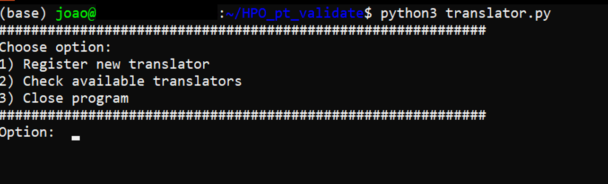
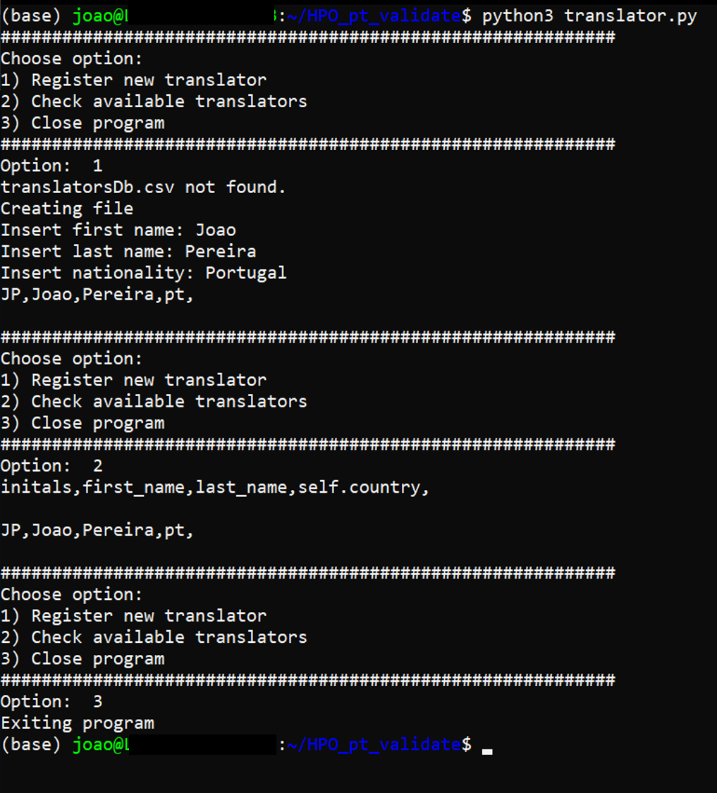
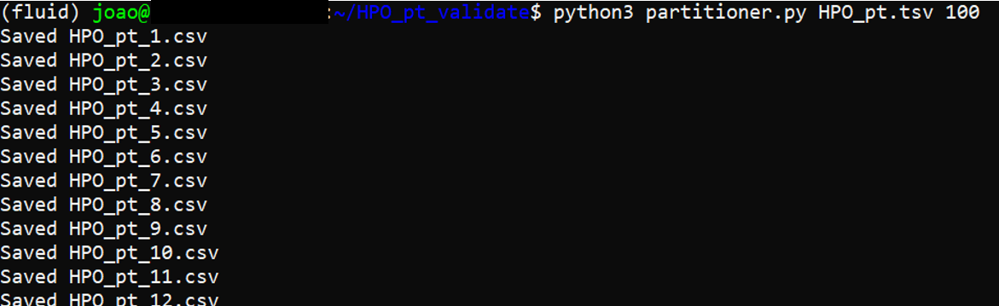
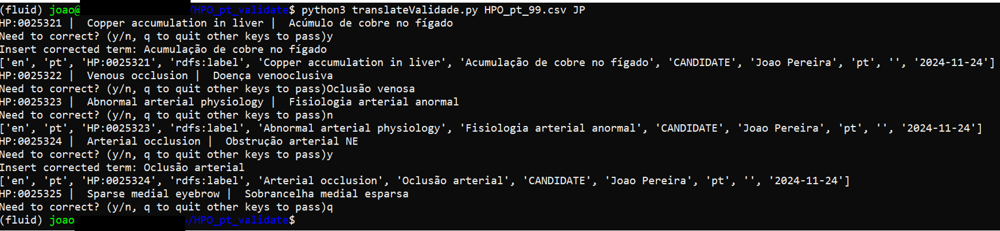

# HPO_pt_validate
## Overview
This compilation of python scripts was created to aid validation of automatic HPO translations using .tsv files that follow the following column order:
+ source_language
+ translation_language
+ subject_id
+ predicate_id
+ source_value
+ translation_value
+ translation_status
+ translator
+ translator_experience
+ comment
+ translation_date

The **translator.py** script creates and appends to a .csv file individual translator information that will be the translator database.
The **partition.py** script will partition the HPO .tsv file in a set ammount of rows. Will output several .csv files (with ';' separators to be used with the validation program)
The **translateValidate.py** script will print to the stdout (the command line console) the source and translation values (from the .csv file) of every term that's not a 'CANDIDATE' and prompt the user to correct, accept or pass the term. Will also have a quit option. Upon accepting or correcting a term it will update the .csv file with the accepted/corrected values and the translator name, nationality (in the expertise field), and date.
The **merger.py** merges a batch translation file with a global translation file using a pandas framework approach.

The _main_ translation file has to be in .tsv (with tab separated values) and the _batch_ translation files have to be .csv files with values separated by semi-colons (;).

## Installation
1) Make sure you have **conda** installed on your command line interface (Mac or Linux terminal or Windows WSL)
2) Clone the repository using 
``git clone https://github.com/jopereira88/HPO_pt_validate.git``
3) Go to the repo directory: 
``cd HPO_pt_validate``
4) Create conda env with 
``conda env create -f env.yml``
5) Transfer the most up to date HPO translation .tsv file you have or use batch .csv files provided

## Use
### translator.py
1) Run _translator.py_ using the command: 
``python3 translator.py``
2) A menu should appear like this one:

3) To start validating batch translations you need to register as a translator (creating a translatorDb.csv file). The following picture shows an example of running the program, using all options.

### partitioner.py
1) _partitioner.py_ will patition the HPO global .tsv file in batches of a said number of rows using the command:~
``python3 partitioner.py path/to/HPOFILE.tsv NUMBER_OF_ROWS(integer value)``
2) The following picture will show running _partitioner.py_ and splitting the global .tsv files into 100-rowed .csv files

### translateValidate.py
1) _translateValidate.py_ requires a valid translatorDb.csv file with at least 1 translator and a batch .csv file with semi-colon (;) separated values
2) Running _translateValidate.py_ is done using the command:
``python3 translateValidate.py BATCH_TRANSLATION.csv TRANSLATOR_INITIALS``
3) As stated above the user will be propted to either accept correct or pass. You can run the same file several times because your work will be saved if you quit (press q) - the .csv will be overwritten
4) The picture below shows an example of a _translateValidate.py_ run showing corrects, accepts and quit:~

### merger.py
_merger.py_ updates a HPO_global.tsv file with batch.csv files using pandas. **Be mindful that this script should only be used to update a single HPO file if you have discontinuous batch translation files**.**You should always back up your global files, specially if you use the _overwrite=True_ option**
It is used with the command:
``python3 merger.py HPO_global.tsv HPO_batch.csv``
It has two other options that need to be changed in script (using nano, vi or ther text editors):
Verbose (Default=False): prints the replacement of lines for debugging purposes
Overwrite (Default=False): if false outputs an HPO_global_updated.tsv file, if true overwrites HPO_global.tsv